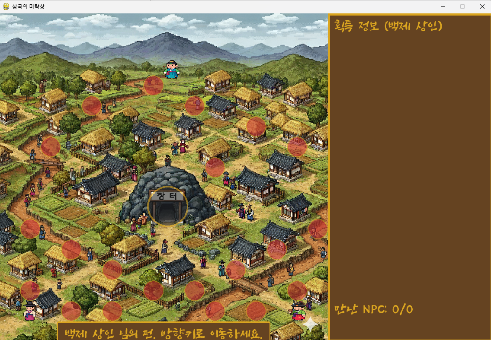
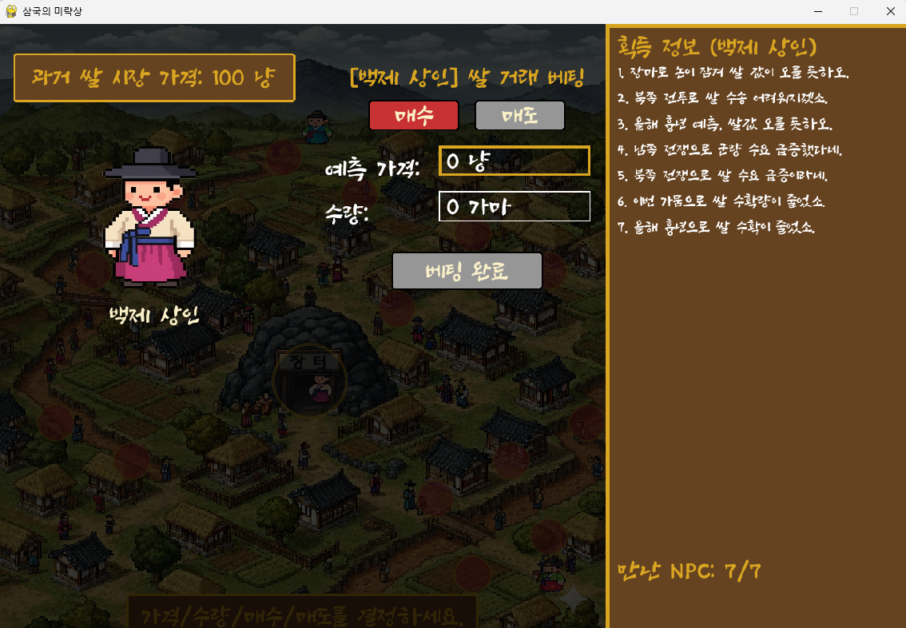

# 🍚 삼국의 미략상 (Rice Trader of Three Kingdoms)

> **"BUY AND PRAY는 가라! 이제는 데이터를 정량적으로 분석하여 미래를 예측한다."**

---

## ⚔️ 1. 게임 소개 및 기획 의도

끝없는 삼국(고구려, 백제, 신라) 간의 전쟁으로 나라가 혼란스러운 그 때, 쌀 가격을 예측해 권력을 지배하려는 시대의 쌀 트레이더 상인들이 등장합니다. 플레이어는 세 상인 중 한 명이 되어 한정된 정보를 바탕으로 **불완전경쟁시장**에서 최적의 베팅 가격과 수량을 결정해야 합니다.

* **배경:** 혼란스러운 삼국 시대의 쌀 시장
* **목표:** 고구려 상인, 백제 상인, 신라 상인 중 **최후의 승자**가 되는 것.
* **기획 의도:** 그 때 그 시절 상인들의 **노하우**를 통해, 단순히 운에 기대는 것이 아닌 **데이터를 정량적으로 분석**하여 미래를 예측하는 트레이딩의 본질을 체험하며 **코스피 5000 시대**를 준비합니다.

---

## 🗺️ 2. 게임 규칙 및 핵심 메커니즘

### 🎯 참가자 및 정보 수집
* **참가자:** 고구려 상인, 백제 상인, 신라 상인 **총 3명의 플레이어**가 참여합니다.
* **NPC:** 게임 내 총 **21명**의 NPC가 존재하며, 이들은 AI 모델이 생성한 시장 정보를 제공합니다.
* **정보 제한 (불완전 경쟁):** 각 상인은 최대 **7명**의 NPC만이 제공하는 한정된 정보를 가지고 최종 가격을 예측해야 합니다. (21명 모두의 정보를 얻을 경우 완전 경쟁 시장이 되지만, 현실적인 요소를 위해 제한됩니다.)

### 📈 최종 쌀 가격 도출 기준
최종 쌀 가격은 **(NPC 정보) + (시장 변동성) + (상인 심리) 세 가지 요인**을 종합하여 결정됩니다.

1.  **NPC 정보 반영 (진실):**
    * **상승 요인:** 가격에 **2% 상승** 요인 반영 (NPC 1인당).
    * **하락 요인:** 가격에 **2% 하락** 요인 반영 (NPC 1인당).
2.  **시장 변동성:**
    * 상기 가격에 **10% 내외**의 무작위 변동성을 추가로 반영합니다.
3.  **상인 심리 반영:**
    * 최종적으로, **모든 상인이 베팅한 가격의 평균값**을 반영하여 시장의 심리적 요인까지 결정 가격에 녹여냅니다.

---

## 💻 3. 프로젝트 기술 스택 및 구조

### ⚙️ 기술 스택
| 구분 | 기술 | 설명 |
| :--- | :--- | :--- |
| **언어** | **Python** | 메인 개발 언어 |
| **프레임워크**| **Pygame** | 2D 게임 개발 라이브러리 |
| **API** | **OpenAI API** | NPC 대사 및 정보 생성을 위한 AI 모델 활용 |

### 📂 프로젝트 구조
```
rice_trading/
├── main.py                     # 메인 게임 루프 및 초기 설정
├── requirements.txt            # 프로젝트 의존성 목록
├── .env                        # OPENAI_API_KEY 등 환경 변수 저장 (Git 무시됨)
│
├── assets/
│   ├── images/                 # 게임 맵 및 플레이어 스프라이트
│   └── fonts/
│       └── SSRockRegular.ttf   # 게임 폰트
│
├── config/
│   ├── __init__.py             # config 모듈 초기화
│   └── game_data.py            # NPC 위치, TARGET_NPCS 등 게임 상수 정의
│
└── core/                       # 게임 핵심 로직 모듈
    ├── __init__.py             # core 모듈 초기화
    ├── player.py               # Player 클래스 (상인)
    ├── npc.py                  # NPC 클래스 및 AI 대사 생성 로직
    ├── market.py               # Market 클래스 (거래 장소)
    ├── ui.py                   # Button 클래스, 정보 패널 및 베팅 UI 렌더링 함수
    └── function.py             # 유틸리티 함수 (텍스트 줄 바꿈, 최종 가격 계산 등)
```

---

## 🎮 4. 게임 구현 화면 예시

아래는 실제 게임 플레이 화면 예시입니다 👇

| 메인 화면 | 베팅 화면 |
|:--:|:--:|
|  |  |
